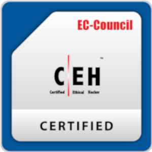
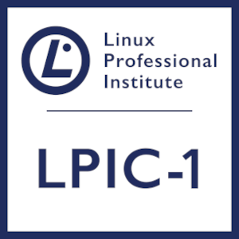

# ¡Hola! 👋 Soy Abel

Soy **Abel Suárez**, graduado en **Administración de Sistemas Operativos Informáticos en Red** y un **entusiasta de la ciberseguridad**. Me apasiona aprender y compartir mis conocimientos sobre tecnologías de seguridad informática y sistemas.

---

## 🛠️ Habilidades principales

Puedes ver más información sobre mí en mi [Portfolio web](https://suarezmuinho.com).

---

## 🌐 Enlaces

    

---

Si tienes alguna duda o deseas ponerte en contacto, puedes escribirme a:  
✉️ [abelsuarezmuino04@gmail.com](mailto:abelsuarezmuino04@gmail.com)

---

## 📚 Certificados

    
    

---

